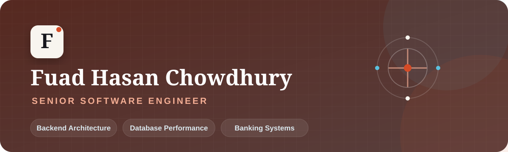

  

  
  
  

## Hello, I'm Fuad 👋

I'm a **Senior Software Engineer** with **7+ years of experience** building backend and database-driven platforms for banking, fintech, and government services.

I work across the full software lifecycle—from requirements and architecture to development, deployment, production support, and performance optimization. I care about systems that remain reliable under pressure, data that stays correct, and engineering work that creates measurable business value.

> Open to Senior Software Engineer, Backend Engineer, Platform Engineer, and Database Engineer opportunities.

## At a glance

| 7+ years | 12+ systems | 100K+ users | 20–30% faster |
|:--:|:--:|:--:|:--:|
| Professional experience | Banking & government platforms | Financial platform scale | Performance gains through database tuning |

## What I bring

- **Backend architecture:** production-grade APIs and services using Node.js, Java, and Python
- **Database performance:** indexing, partitioning, SQL tuning, query-plan analysis, backup, and recovery
- **Banking domain expertise:** agent banking, internet banking, payment gateways, reconciliation, and messaging systems
- **Production ownership:** Docker environments, CI/CD pipelines, deployments, incident response, and root-cause analysis
- **Business impact:** reduced daily reconciliation work by approximately 4–5 hours through automation

## Technology toolbox

**Backend & languages**  

**Data**  

**Delivery & platforms**  

## Selected work

### Agrani Agent Banking System

Built and maintained backend services for secure, highly available agent-banking operations, with hands-on ownership of production reliability and support.  
`Node.js` `Java` `PostgreSQL` `Docker`

### Bank Payment Gateway System

Contributed to integration-heavy payment and reconciliation workflows, automating operations and reducing daily manual effort by approximately 4–5 hours.  
`Java` `SQL` `Bash` `CI/CD`

### MRA Office Management & NID Verification

Delivered backend and database capabilities for government-grade workflows, including reporting, stability improvements, and critical issue resolution.  
`Node.js` `Python` `MySQL` `Oracle`

Some enterprise source code and implementation details are confidential. More context is available upon request.

## Experience

**Software Engineer · Celloscope Ltd** — Oct 2021–Present  
Building and supporting high-scale banking systems, improving database performance, and strengthening containerized delivery and CI/CD workflows.

**IT Executive & Database Administrator · DOER Services PLC** — Oct 2018–Sep 2021  
Managed operational databases, monitoring, optimization, data integrity, production stability, and live client support.

## Let's connect

I'm based in **Bangladesh** and open to remote and on-site collaboration.

- 🌐 [Explore my portfolio](https://fuad-hasan-mugdho.github.io/my_portfolio_website/)
- 💼 [Connect on LinkedIn](https://www.linkedin.com/in/fuad-hasan-mugdho/)
- ✉️ [Email me](mailto:fuadhasan642@gmail.com)

  Backend architecture · Database performance · Reliable systems

